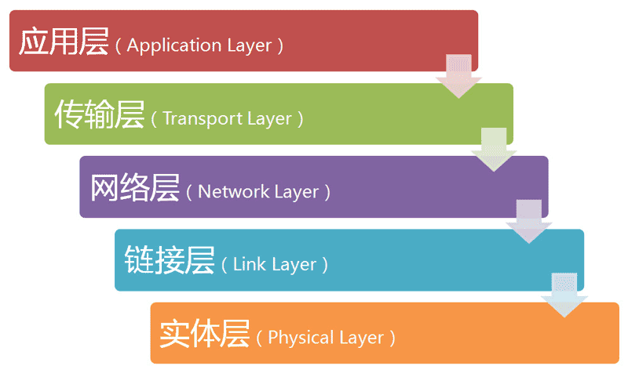

# Http Introduction

# Overview

# 1. 五层协议
  
   
refer to　http://www.ruanyifeng.com/blog/2012/05/internet_protocol_suite_part_i.html

## 1.1 物理层（Physical Layer）
    负责传送0和1的电信号，光缆、电缆、双绞线、无线电波等。
    
    1 byte = 8 bits  
    1 KB (KiloByte)= 1024 bytes  
    1 MB (MegaByte)= 1024 KB	 
    1 GB (GigaByte)= 1024 MB  
    1 TB (TrillionByte)= 1024 GB  
    1 PB (PetaByte)= 1024 TB  
    1 EB (ExaByte)= 1024 PB
    
    bps = bits per second 
  
## 1.2 连接层 (Link Layer)
    确定0和1的分组方式，"以太网"（Ethernet）协议   
    网卡地址叫MAC地址, 全世界独一无二  
    数据包（Frame）从（同一子网）一块网卡发送到另一块网卡 
   
### 1.2.1 ARP（Address Resolution Protocol）协议
    用报文中的IP地址让子网中的主机报告IP地址  　
    IP为192.168.22.11的主机 请报告你的MAC地址 
    ARP缓存表
    
主机名称|IP地址|MAC地址
:---|:---|:---
A|192.168.38.10|00-AA-00-62-D2-02
B|192.168.38.11|00-BB-00-62-C2-02
C|192.168.38.12|00-CC-00-62-C2-02
D|192.168.38.13|00-DD-00-62-C2-02
E|192.168.38.14|00-EE-00-62-C2-02
    
### 1.2.2 广播（broadcasting）
    请MAC地址为 54-48-10-EB-99-53 的主机接受报文数据
    
## 1.3 网络层（Network Layer） 
    如何确定子网？引入IP协议。
    IP协议两个主要作用
        为每一台计算机分配IP
        确定哪些主机在同一个子网络（子网掩码）
    两主机的IP不在同一个子网络， 无法得知MAC地址， 路由协议发送给两子网络的网关（Gateway）
    如果两IP在同一个网络，通过ARP得知MAC后，广播即可将报文送达。
    如此，两台主机可通过IP建立通信。
    
## 1.4　传输层（Transport Layer）
    一主机和多个主机通信，端口（port）登场
    主机（host）+ 端口(port)= 套接字(socket)
    引入了端口，所以需要新的协议
### 1.4.1 UDP
    简单（Header 8 Bytes），不可靠，不可感知报文是否送达，单个报文有长度限制
### 1.4.2 TCP
    复杂，消耗大，可靠，长度可分割成多个请求。    

## 1.5 应用层 （Application Layer）
    HTTP, FTP, WWW, Email等等。

# 2.HTTP协议
    http 协议是应用层协议，一般选择与传输层协议TCP搭配。
    常见的Status
    常见的Method
    Headers　
   [RFC2616](https://www.w3.org/Protocols/rfc2616/rfc2616.html)
## 2.1 Http Status Code
    Informational 1xx ... 
    Successful 2xx ...
    Redirection 3xx ...
    Client Error 4xx ...
    Server Error 5xx ...
## 2.2 Http Method
    GET
    POST
    HEAD
    
    PUT 
    DELETE
    TRACE
    OPTIONS
    CONNECT
## 2.3 Http Headers
    

   